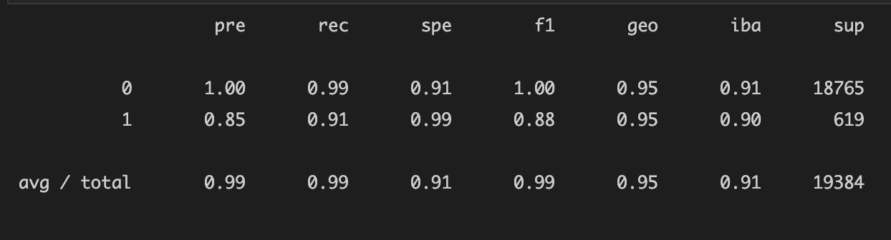
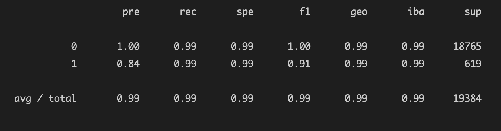

# Module 12 Report Template

## Overview of the Analysis

Credit risk poses a classification problem that is imbalanced because healthy loans outnumber risky loans. In order to determine the best way to analyze the credit risk data, I compared two logistic regression model: the first analyzes the data as is and the second uses the random over sampler module to re-balance the data. Both models include a count of the target classes (value_counts), trained a logistic regression classifier, calculated the balanced accuracy score, generated a confusion matrix, and generated a classification report. 

Required libraries to import:
```python
import numpy as np
import pandas as pd
from pathlib import Path
from sklearn.metrics import balanced_accuracy_score
from sklearn.metrics import confusion_matrix
from imblearn.metrics import classification_report_imbalanced

import warnings
warnings.filterwarnings('ignore')

from sklearn.model_selection import train_test_split
from sklearn.linear_model import LogisticRegression
from imblearn.over_sampling import RandomOverSampler
```

## Results

* Machine Learning Model 1:
  * Balanced Accuracy Score: 95.2% accurate
  * Precision: more precise for the healthy loans (most likely caused by the larger number of healthy loans)
  * Recall: high for both, but higher for healhty loans




* Machine Learning Model 2:
  * Balanced Accuracy Score: 99.4% accurate
  * Precision: more precise for the healthy loans; risky loans are slightly less precise than the first model
  * Recall: same for both, risky loans recall increased from the first model



## Summary

I would recommend using the second model. It has a higher accuracy score, similar precision, and higher recall information when compared with the first model.
